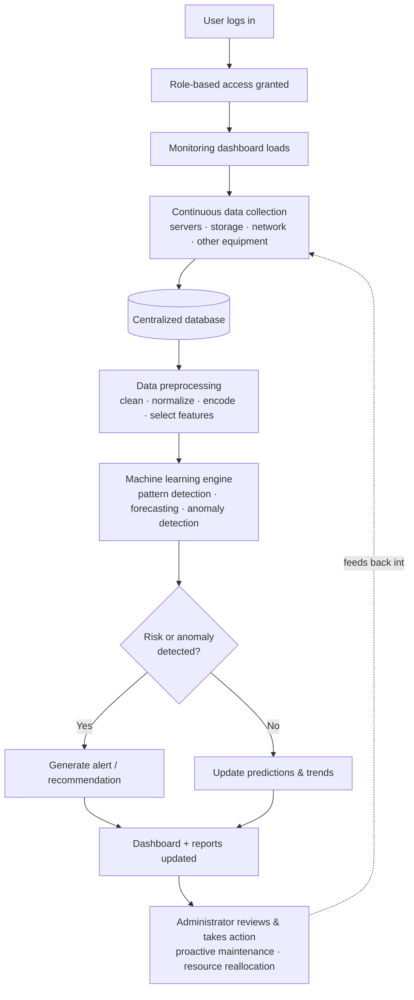

# Datacenter Resource Management & Predictive Analytics System — Summary

Source: `design/systemoverview.docx` (RRA Main Datacenter proposal, Ch. 4 — System Analysis, Design & Implementation)

## 1. Overview

A centralized, web-based platform that replaces multiple vendor-specific monitoring tools with one system. It combines **resource monitoring**, **equipment inventory**, **predictive analytics (ML)**, **reporting**, and **user management**. It continuously collects operational data (CPU, memory, storage, network, equipment status), runs it through machine learning models, and surfaces the results on interactive dashboards so administrators can act proactively instead of reactively.

## 2. System Flow

**Narrative:** An authenticated user opens the dashboard → the system continuously pulls utilization data from every datacenter device → readings are stored centrally → the ML module analyzes historical + real-time data to spot patterns, forecast demand, and flag abnormal behavior → when something crosses a risk threshold, an alert and recommendation are generated → all results (healthy or not) flow into the dashboard and reports → the administrator uses that to act proactively, which in turn shapes the next round of monitoring.

## 3. Functional Requirements

| # | Requirement | Description |
|---|---|---|
| 1 | User Authentication | Secure login with role-based access |
| 2 | Dashboard Management | Real-time summaries of resource utilization & equipment status |
| 3 | Server Monitoring | CPU, memory, storage, server health |
| 4 | Storage Monitoring | Capacity, utilization, available disk space |
| 5 | Network Monitoring | Traffic, bandwidth, latency, connectivity |
| 6 | Equipment Inventory Management | Records of servers, switches, routers, storage devices, etc. |
| 7 | Resource Utilization Monitoring | Continuous metric collection across devices |
| 8 | Predictive Analytics | ML-based forecasts of utilization trends & potential failures |
| 9 | Alert Management | Alerts on abnormal utilization or predicted failure |
| 10 | Report Generation | Monitoring, performance, and prediction reports |
| 11 | User Management | Admins create/update/delete accounts & permissions |

## 4. Non-Functional Requirements

| # | Requirement | Description |
|---|---|---|
| 1 | Performance | Real-time monitoring, minimal response delay |
| 2 | Reliability | Continuous, high-availability, accurate monitoring |
| 3 | Security | Secure auth + role-based access control |
| 4 | Scalability | New servers/storage/network/users added without degrading performance |
| 5 | Usability | Simple, user-friendly interface |
| 6 | Maintainability | Easy to update, troubleshoot, extend |
| 7 | Availability | Accessible whenever monitoring/management is needed |
| 8 | Compatibility | Works across multiple hardware vendors |
| 9 | Data Integrity | Monitoring/prediction data stays accurate & consistent |
| 10 | Backup & Recovery | Data backup/recovery to minimize loss on failure |

## 5. Existing vs. Proposed System

| Area | Existing System | Proposed System |
|---|---|---|
| Monitoring | Separate vendor-specific tools | Centralized monitoring |
| Data management | Fragmented across platforms | Centralized database |
| Fault detection | Manual, reactive | Automated, predictive |
| Resource analysis | Limited historical analysis | ML-based trend analysis |
| Alerts | Basic thresholds | Intelligent alerts & recommendations |
| Reporting | Manual | Automatic |
| Decision-making | Current observations only | Real-time + predictive insight |
| Maintenance | After the fact | Proactive |
| Resource planning | Limited forecasting | Predicts future needs |
| Operational efficiency | Slow, complex | Faster, integrated, efficient |

## 6. System Architecture (Layered)

1. **Presentation layer** — web UI: dashboards, equipment info, alerts, predictions, reports
2. **Application layer** — handles requests, coordinates between UI, DB, monitoring, and ML module
3. **Monitoring layer** — collects data from servers, storage, network, virtualization platforms
4. **Data layer** — centralized database storing all collected metrics and results
5. **Machine learning layer** — preprocesses data, detects patterns/anomalies, forecasts, generates recommendations, hands results back to the application layer for display

## 7. Machine Learning Pipeline

**Data sources:** servers, storage, network equipment, virtualization platforms, power systems, environmental sensors, system logs
**Variables:** CPU utilization, memory usage, disk/storage capacity, network traffic & latency, equipment status, temperature, power consumption, error logs, timestamps
**Historical range referenced:** 2020–2025

**Pipeline steps:**
1. Collect (historical + real-time)
2. Preprocess — clean, deduplicate, impute missing values, normalize numeric features, encode categorical fields
3. Feature selection — CPU/memory/storage utilization, disk I/O, network bandwidth/latency, power, temperature, device status, event logs
4. Split into train/test sets
5. Train candidate algorithms: **Random Forest, SVM, XGBoost, ANN, LSTM**
   - RF & XGBoost → high accuracy on structured data
   - SVM → anomaly classification
   - ANN → nonlinear relationships
   - LSTM → time-series forecasting
6. Evaluate — Accuracy / Precision / Recall / F1 (classification), MAE / RMSE / R² (regression)
7. Deploy best-performing model → continuously scores new data → predictions, risk flags, recommendations → stored in DB → surfaced via dashboard, alerts, reports

## 8. Database Design (Core Entities)

`User` · `Datacenter Device` · `Resource Metric` · `Machine Learning Model` · `Prediction` · `Alert` · `Report`

Devices, metrics, predictions, alerts and reports all link back through the central `Database`, letting the system trace any alert or report back to the raw metrics and the model that produced it.

## 9. Class Structure

- **User** → specialized into `Administrator` and `Viewer` (role-based access)
- **Datacenter Device** → specialized into `Blade Switch`, `Storage Device`, `Host Server`
- **Resource Metric** — data collected from devices, persisted to the database
- **Machine Learning Model** — trains on metrics, produces `Prediction`
- **Prediction** → drives `Alert` generation and feeds `Report` generation

## 10. Tech Stack (as specified in the document)

| Layer | Technology |
|---|---|
| Frontend | React.js |
| Backend | Python + Django |
| Database | MySQL |
| ML libraries | Scikit-learn, TensorFlow, Pandas, NumPy, Matplotlib |
| Version control | Git |
| Dev hardware baseline | Intel i5 equivalent, 8 GB RAM, 256 GB storage |
| OS | Windows or Ubuntu |

> Note: this is the stack described in the thesis document. The codebase in this repo (`frontend/`) is React + Firebase/Firestore, not Django/MySQL — worth keeping in mind if this document is used as a spec to build against rather than as a record of a separate reference implementation.

## 11. User Interface Modules

| Screen | Purpose |
|---|---|
| Home Page | Entry point, overview, navigation to main features |
| Login Page | Secure authentication, role-based access |
| Dashboard | Central KPI overview: server status, CPU/RAM/storage/network, active alerts, predictions |
| Server Monitoring | Real-time CPU/memory/disk/availability per server |
| Storage Monitoring | Capacity, available space, I/O performance, health |
| Network Monitoring | Bandwidth, traffic, latency, packet transmission, connectivity |
| Resource Utilization | Charted CPU/memory/storage/power trends |
| Predictive Analytics | ML forecasts and bottleneck identification |
| Predictive Maintenance | Equipment health + recommended maintenance actions, ahead of failure |
| Report Generation | Select category/time range, export reports |
| Audit Log | Who did what, when, and the result — for accountability/security |
| System Configuration | Monitoring parameters, prediction settings, app preferences |
| User Profile | Account details, password, preferences |

## 12. Where This Diverges From the Current App

The `frontend/` app in this repo (Server Management, Storage Management, Resources) currently implements **manual tracking** — status fields, CRUD records, logged snapshots the admin enters by hand. This document describes a considerably larger scope on top of that:

- A live monitoring agent pipeline (data collection is automatic here, manual in the app today)
- A trained ML layer for forecasting/anomaly detection (not present in the app)
- Predictive Maintenance as a distinct module
- A Django/MySQL backend instead of Firebase/Firestore

If the goal is to build toward this document, the ML layer and an actual data-collection agent are the two biggest missing pieces — everything else (equipment inventory, dashboards, alerts, reports, user management) already has a structural analogue in what's been built so far.
